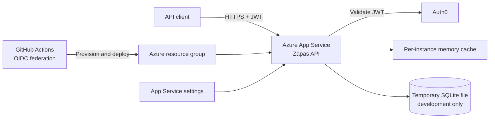

# Week 1: Cloud Foundations

## Engineering question

How do we make the local Zapas API cloud-ready?

## Week outcome

By the end of this week, Zapas should have a repeatable path from a clean checkout to a small Azure development environment. The path must build and test the application, provision its compute and configuration, deploy it, expose a useful health signal, and leave enough evidence for another engineer to understand and reproduce the result.

This is a learning deployment, not a claim that Zapas is production-ready.

## Why this week matters to Zapas

Zapas already has a useful application boundary:

- An ASP.NET Core API targeting .NET 10.
- Authenticated session endpoints with role-based upload authorization.
- Synchronous FIT parsing with explicit file-size and rate limits.
- EF Core with SQLite and migrations.
- In-process caching.
- Request and exception middleware.
- A database health check at `/health`.
- Eleven passing automated tests at the start of this playbook.

It does not yet have:

- A cloud hosting decision or architecture record.
- Production configuration.
- Infrastructure as code.
- A build or deployment pipeline.
- A documented deployment artifact.
- Separate liveness and readiness behavior.
- A production data store.
- Cloud telemetry or operational alerts.

The current test baseline also reports high-severity package vulnerability warnings involving transitive `Microsoft.OpenApi` and `SQLitePCLRaw.lib.e_sqlite3` packages. Week 1 must record and assess these warnings; it must not silently accept them.

## Scope boundary

Week 1 creates a disposable Azure development deployment and the engineering path around it.

The recommended compute choice for the first deployment is Azure App Service on Linux because Zapas is one HTTP API and does not yet need container orchestration. Record the final decision in an ADR after comparing App Service, Azure Container Apps, and Azure Functions. If the selected Azure region or App Service runtime does not support the application's .NET target, either choose a supported region/runtime or document a switch to a container deployment. Do not downgrade the project casually just to make a tutorial command work.

SQLite may be used only for a single-instance, disposable learning deployment. Its file is local to the application host, is not a safe scale-out database, and may be lost when the environment is replaced. Week 2 owns the durable data-store design and migration. Do not add Azure SQL, Cosmos DB, Service Bus, Key Vault, or AI services this week unless a demonstrated requirement changes the scope.

## Definition of done

Week 1 is complete when:

- `dotnet test Zapas.slnx` passes in a clean CI job.
- Dependency vulnerability warnings have an owner and a documented disposition.
- Runtime settings are supplied outside source-controlled production files.
- Zapas has distinct liveness and readiness endpoints with tests.
- The hosting choice and its alternatives are captured in an ADR.
- The Azure development environment can be created from source-controlled infrastructure.
- The application can be published and deployed without an IDE.
- CI validates every change and CD uses short-lived/federated Azure credentials.
- The deployed API responds over HTTPS and its health behavior is verified.
- An architecture diagram shows users, identity provider, Azure boundary, API, configuration, and temporary SQLite storage.
- The cost, scaling, data-loss, rollback, and teardown limitations are written down.
- The Friday Tech Lead Review has been completed and recorded.

## Daily plan

| Day | Engineering focus | Repository outcome |
| --- | --- | --- |
| [Day 1](week01_day01.md) | Baseline and cloud-readiness assessment | Reproducible baseline, request-path diagram, risk register, first living documents |
| [Day 2](week01_day02.md) | Runtime contract and hosting decision | Configuration contract, liveness/readiness endpoints, tests, compute ADR |
| [Day 3](week01_day03.md) | Repeatable Azure environment | Bicep infrastructure, parameter strategy, publish/deploy runbook |
| [Day 4](week01_day04.md) | CI/CD and deployment safety | CI workflow, federated deployment workflow, smoke test, rollback procedure |
| [Day 5](week01_day05.md) | Deployment, evidence, and defense | Deployed development API, final diagram, review notes, teardown evidence |

Each day follows the residency loop: Problem, Design, Build, Explain, Defend, Reflect.

## Target repository shape

Names may change if an ADR justifies a better structure, but the end of the week should resemble:

```text
.
|-- .github/
|   `-- workflows/
|       |-- ci.yml
|       `-- deploy-dev.yml
|-- documents/
|   |-- adr/
|   |   `-- 0001-host-zapas-on-azure-app-service.md
|   |-- architecture/
|   |   `-- week01-azure-development.md
|   |-- architecture_evolution.md
|   |-- decision_log.md
|   |-- engineering_wisdom.md
|   |-- tech_lead_reviews.md
|   `-- week01_*.md
|-- infrastructure/
|   |-- main.bicep
|   `-- parameters/
|       `-- dev.bicepparam
|-- scripts/
|   |-- deploy-dev.ps1
|   `-- smoke-test.ps1
|-- Zapas.Api/
|-- Zapas.Api.Tests/
`-- Zapas.slnx
```

Generated publish output, deployment archives, local databases, secrets, and Azure CLI output do not belong in Git.

## Proposed development architecture



This diagram is the initial hypothesis. Day 5 must update it to match what was actually deployed.

## Cloud-readiness risks to carry through the week

| Risk | Why it matters | Week 1 treatment | Long-term owner |
| --- | --- | --- | --- |
| SQLite uses local host storage | Replacement or scale-out can lose or split data | Single instance, disposable data, explicit warning | Week 2 |
| `IMemoryCache` is per instance | Cache behavior changes when instances scale | Keep one instance; document constraint | Week 3 or 5 |
| Upload limiter is per instance and keyed by remote IP | Limits are not globally coordinated | Document and test one-instance behavior | Week 3 or 5 |
| FIT parsing runs on the request path | CPU and request duration affect capacity | Preserve bounds; capture latency during smoke test | Week 5 |
| Production connection string is absent | Readiness will fail without runtime configuration | Supply through platform settings | Week 1 |
| Auth0 authority, audience, and CORS vary by environment | Incorrect settings break auth or expose callers | Define and validate runtime configuration contract | Week 1 |
| Dependency vulnerability warnings are present | Known vulnerable code may ship | Investigate direct/transitive versions and record disposition | Week 1 |
| No cloud telemetry backend | Logs may be difficult to query after failure | Use platform log stream for initial proof | Week 5 |
| Session-by-ID ownership behavior needs a security review | A valid user may be able to request another user's session by ID | Add to decision/risk log; address in the security phase or sooner | Week 4 |

## Required evidence

Keep concise evidence rather than screenshots of every click:

- Test and publish command output.
- `az deployment group what-if` and deployment results.
- The deployed application URL and UTC verification time.
- HTTP status and body for liveness and readiness.
- A failed-readiness demonstration using deliberately invalid non-secret configuration.
- Workflow run links or identifiers.
- The deployed resource inventory and relevant tags.
- The rollback result.
- The Azure resource deletion result after the review, if the environment is not retained.

Never capture access tokens, publish profiles, connection strings, or credential values in evidence.

## Suggested timebox

Plan for 2.5 to 4 focused hours per day:

- 20 minutes: problem and current-state review.
- 30 minutes: design and trade-offs.
- 90 to 150 minutes: implementation and tests.
- 20 minutes: explanation and defense.
- 15 minutes: reflection and documentation.

If time is constrained, preserve the design record, automated test, and evidence. Reduce optional polish before reducing safety.

## Friday review scorecard

Score each area from 0 to 2:

| Area | 0 | 1 | 2 |
| --- | --- | --- | --- |
| Reproducibility | Manual/unknown | Partly scripted | Clean, documented, repeatable |
| Configuration | Values embedded in code | External but weakly defined | External, validated, and documented |
| Health | No meaningful signal | One shallow endpoint | Liveness/readiness semantics tested |
| Infrastructure | Portal-only | Partial IaC | Idempotent IaC plus what-if |
| Delivery | IDE/manual only | CI or CD | CI and federated CD with rollback |
| Architecture reasoning | Service-name recall | Some trade-offs | Decision defended from Zapas requirements |
| Operational honesty | Limitations hidden | Limitations listed | Risks, owners, and next decisions explicit |

A score below 10/14 means the week needs a short remediation plan before Week 2 begins.

## Senior-level questions

At the end of the week, answer these without notes:

1. Why is App Service the current recommendation for Zapas?
2. What new capabilities would justify Azure Container Apps?
3. Why does a successful process response not prove the application is ready?
4. Why is SQLite acceptable for this exercise but not for scaled production?
5. Which configuration belongs in code, normal environment settings, and secret storage?
6. What exactly happens between a Git commit and a deployed Zapas assembly?
7. How does the pipeline authenticate to Azure without a long-lived secret?
8. What would fail first if FIT-upload traffic increased by 100 times?
9. How would you detect a bad deployment and restore service?
10. Which Week 1 decision are you least confident in, and what evidence would change it?

