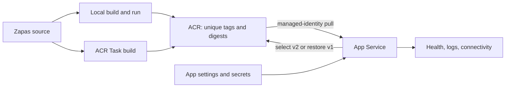

# Week 1 — Container Image Lifecycle and App Service Containers

## 1. Week overview

**Engineering question:** How do we package Zapas consistently, manage its images, and run the container on an Azure managed web platform?

**AI-200 objectives:** C1 — build, store, version, and manage images with Azure Container Registry (ACR); C2 — build and run images with ACR Tasks; C3 — deploy containers to Azure App Service and supply environment variables and secrets.

**Starting state:** Zapas is one ASP.NET Core API plus an xUnit project. It has validated configuration, SQLite persistence, and liveness/readiness endpoints, but no container or Azure deployment assets.

**Expected ending state:** Zapas has production-oriented packaging, passes local checks, has two unique versions and an ACR Task build in ACR, and runs a selected version in App Service with external configuration. Startup, health, logs, connectivity, update, rollback, and one controlled failure are evidenced. A small Python image supplies isolated language exposure.

**Total required budget:** 10 hours: five 120-minute sessions. The five-day allocations below total exactly 600 minutes.

**Main practical evidence:** container files, local run, ACR tag/digest inventory, ACR Task logs, redacted App Service evidence, update/rollback record, failure report, bounded Python image, ADR, exam notes, and competency/cleanup updates.

**Scope classification:**

- **Required (10 hours):** all five daily completion gates and the deliverables in section 7.
- **Optional reinforcement (outside the 10 hours):** repeat the lifecycle without notes; inspect tag locking/retention; add a narrow container smoke test.
- **Stretch:** a reusable multi-step ACR Task, automated trigger, or App Service deployment slot. Do not displace required work.
- **Deferred:** Week 2 hosting/orchestration work and later security, observability, and data-platform work listed in section 6.

Official sources: [AI-200 study guide](https://learn.microsoft.com/en-us/credentials/certifications/resources/study-guides/ai-200) (updated May 5, 2026), [ACR Tasks](https://learn.microsoft.com/en-us/azure/container-registry/container-registry-tasks-overview), [image tagging](https://learn.microsoft.com/en-us/azure/container-registry/container-registry-image-tag-version), [custom containers](https://learn.microsoft.com/en-us/azure/app-service/configure-custom-container), [App Service settings](https://learn.microsoft.com/en-us/azure/app-service/configure-common), and [Health Check](https://learn.microsoft.com/en-us/azure/app-service/monitor-instances-health-check).

> Complete code, commands, Azure CLI steps, portal procedures, validation instructions, and troubleshooting guidance will be generated during the relevant daily session after Codex re-inspects the current repository state.

## 2. Repository baseline

**Facts observed on July 24, 2026:**

- `Zapas.slnx` contains .NET 10 projects `Zapas.Api/` and `Zapas.Api.Tests/`; `Program.cs` composes startup through extension methods.
- `Zapas.Api/Extensions/ApplicationBuilderExtensions.cs` exposes anonymous `/health/live` and `/health/ready`. Liveness has no dependency checks; readiness includes the EF Core SQLite check registered in `PersistenceServiceCollectionExtensions.cs`.
- `HealthEndpointTest.cs` verifies live/ready success and database failure. The 14 xUnit facts cover health, controllers, repository, parsing, validation, and caching with in-memory SQLite and test authentication—not containers or Azure.
- Configuration is externalizable. `appsettings*.json` contains logging only; upload defaults live in code; JWT values and `ConnectionStrings:ZapasDb` must be supplied. User secrets support local work, and invalid JWT values stop startup.
- SQLite, `IMemoryCache`, and rate-limit counters are process-local. `learnings/architecture/week01-current-state.md` already records restart and multi-instance implications; that analysis should not be duplicated.
- No container file, Azure IaC/workflow/asset, ADR, or populated residency evidence exists. No `AGENTS.md` was found in the repository or parent chain.

**Relevant paths:** `Zapas.Api/Zapas.Api.csproj`, `Program.cs`, `Extensions/`, `Options/`, `appsettings*.json`, `Zapas.Api.Tests/Health/`, `.gitignore`, `README.md`, `learnings/architecture/week01-current-state.md`, and `documents/senior_azure_ai_engineering_residency.md`.

**Missing capabilities:** Linux packaging/build context, port and SQLite container contracts, local evidence, image policy, ACR/Task/App Service assets, rollback, and container troubleshooting.

**Prerequisites:** Linux-container engine, .NET 10 base images, current Azure CLI, an authenticated subscription with resource/role-assignment rights, approved region/SKU and budget alert, unique names, and safe Zapas lab settings. Check ACR permission mode because ABAC and registry-wide RBAC use different roles.

**Day 1 assumptions to check:** Docker and Azure access work; ACR Tasks are permitted by the subscription; the chosen runtime port is consistent across the image and App Service; nested .NET keys will use environment-variable form; SQLite can be created and written at the selected lab path; readiness does not redirect; and the local ignored `Zapas.Api/Zapas.db` will not enter the image.

**Schedule risks:** ACR Tasks are documented as temporarily paused for Azure free credits; role propagation can delay pulls; missing JWT values stop startup; port/HTTPS behavior can break Health Check; ephemeral SQLite can break readiness after restart. SQLite is disposable single-instance lab storage.

## 3. Weekly architecture direction

Local work produces a deterministic image from a minimal context with runtime configuration and no baked secrets. A unique tag links source/build evidence; the digest identifies the manifest. ACR stores Zapas and Python lab repositories. An ACR quick task (`az acr build`) proves the Dockerfile builds in Azure.

App Service pulls a selected version through managed identity and least-privilege read access. Its settings become environment variables; values remain outside source and image. Key Vault is deferred. App Service routes to the container port, monitors health, and exposes logs.

A second unique image is deployed. Rollback selects the evidenced prior tag or digest and revalidates it; it never depends on mutable `latest`.



## 4. Weekly objective map

| Objective | Knowledge outcome | Practical evidence | Troubleshooting evidence | Friday target level |
| --------- | ----------------- | ------------------ | ------------------------ | ------------------- |
| C1 | Explain registry, repository, image, layer, tag, digest, and identifier lifecycle. | Local image plus two unique ACR manifests with digests and version policy. | Distinguish authentication, authorization, missing image, and mutable-tag symptoms. | Level 3 |
| C2 | Explain quick versus persistent/multi-step tasks, cloud context, default push, logs, and identity. | ACR Task build plus one bounded image run; run IDs/logs captured. | Separate context, Dockerfile, base-image, permission, and subscription failures. | Level 3 |
| C3 | Explain image selection, identity pull, port, settings/secrets, health, logs, update, and rollback. | App Service health/log/connectivity, v2 update, and v1 restoration evidence. | Bad-port deployment diagnosed and repaired. | Level 3 |

## 5. Five-day plan

### Day 1 — Container contract and local proof

#### Goal

Produce a repository-owned Zapas image definition that builds and runs locally with observable liveness and readiness.

#### AI-200 objectives

C1, C3.

#### Time allocation

10 minutes repository/prerequisite reinspection; 15 minutes official objectives and container mental model; 55 minutes Dockerfile, `.dockerignore`, and container-compatibility outcomes; 30 minutes local build/run validation; 10 minutes recall and artifact capture.

#### Topics and mental models

Build context, multi-stage build, immutable image versus runtime state, port binding, runtime configuration, liveness/readiness, and HTTPS redirects.

#### Zapas work

- Add a Linux multi-stage `Dockerfile` and minimal `.dockerignore`.
- Keep secrets and the local database out of image layers and context.
- Establish the port/configuration contract and writable disposable SQLite path.
- Preserve the existing split health design and tests.

#### Validation checkpoints

- Tests pass and the Zapas image builds.
- Container starts with explicitly supplied settings and responds on the expected mapped port.
- `/health/live` is healthy; `/health/ready` reflects SQLite availability.
- Image/context inspection finds no database, secret, build output, or repository metadata.

#### Troubleshooting target

Diagnose configuration, port, or writable-storage startup failure; separate build from start failure.

#### Active-recall and exam work

Define core image-lifecycle terms; explain why secrets and mutable data stay outside images; recognize port/configuration scenarios.

#### Daily completion gate

Build and run from that day’s repository state, show both health semantics, and explain the contract with limited reference.

#### Daily artifact

`Dockerfile`, `.dockerignore`, and a concise Day 1 entry in Week 1 exam notes/error log.

### Day 2 — Versioned image lifecycle in ACR

#### Goal

Store a deliberately versioned Zapas image in ACR and trace its source, tag, and digest.

#### AI-200 objectives

C1.

#### Time allocation

10 minutes reinspection and Azure prerequisite/cost checks; 15 minutes official ACR/tagging study; 25 minutes image strategy and ADR decision; 45 minutes registry, authentication, tag/push, and inventory outcomes; 15 minutes diagnostic variation; 10 minutes recall and notes.

#### Topics and mental models

Registry/repository, control/data planes, unique/mutable tags, digest immutability, traceability, roles, retention, and locking.

#### Zapas work

- Establish one repository name and a unique, reproducible tag convention.
- Create the disposable registry and push the validated image.
- Record repository, tag, digest, source, build origin, and rollback use.
- Write the image strategy ADR; discuss retention/locking without expanding scope.

#### Validation checkpoints

- ACR contains the expected Zapas repository and unique image version.
- The digest resolves to the candidate; a clean pull/run preserves Day 1 behavior.
- No registry credential or application secret is committed.

#### Troubleshooting target

Classify one denied or missing-image operation by authentication, role, repository, or tag.

#### Active-recall and exam work

Choose tags versus digests, reject `latest` for rollback, and select pull versus push permissions.

#### Daily completion gate

Demonstrate local-build-to-ACR and identify/recover the exact artifact.

#### Daily artifact

`ADR-001-container-image-strategy.md` and ACR inventory/evidence entry.

### Day 3 — Cloud build and bounded Python exposure

#### Goal

Prove that ACR Tasks can build and run an image, then apply the lifecycle to one minimal Python container.

#### AI-200 objectives

C1, C2.

#### Time allocation

10 minutes reinspection; 10 minutes ACR Tasks study; 30 minutes Zapas task build/run; 35 minutes bounded Python container; 15 minutes .NET/Python comparison; 10 minutes log validation; 10 minutes recall/evidence.

#### Topics and mental models

Local versus remote build, uploaded context, run/logs/default push, task types, and language-neutral container contract.

#### Zapas work

- Build and push a uniquely tagged Zapas image through an ACR quick task.
- Run one bounded image verification through ACR Tasks.
- Record run ID, context, tag/digest, duration, and logs; confirm the local contract.

#### Python work

Create a minimal exam-lab API that reads one environment variable and exposes one response/health surface. Build it through ACR, run once, and compare Python/.NET entry points. Keep it outside Zapas.

#### Validation checkpoints

- ACR Task build and bounded run complete; ACR contains the expected Zapas version.
- Task logs identify context, result, push, tag, and digest.
- The Python image starts and proves environment-variable injection.
- The Python exercise remains isolated and small.

#### Troubleshooting target

Locate a context/Dockerfile failure in logs, or separate subscription availability from image defects.

#### Active-recall and exam work

Select the correct local, quick, scheduled, triggered, or multi-step build and locate its logs.

#### Daily completion gate

Reproduce a cloud build and bounded run with limited references, contrast local build, and show Python evidence.

#### Daily artifact

Reproducible ACR Task notes/run evidence and a short Python-versus-.NET comparison.

### Day 4 — App Service deployment and controlled failure

#### Goal

Run the selected Zapas image on App Service with external configuration, healthy platform behavior, useful logs, and a diagnosed deployment failure.

#### AI-200 objectives

C3, with C1 consumption.

#### Time allocation

10 minutes reinspection; 15 minutes official App Service study; 35 minutes App Service and managed-identity pull outcome; 35 minutes settings, port, health, logs, and connectivity; 15 minutes controlled failure and recovery; 10 minutes recall/reporting.

#### Topics and mental models

Identity pull, least privilege, plan versus app, image selection, environment keys, encrypted settings, TLS termination, Health Check, and logs.

#### Zapas work

- Deploy the selected unique image through managed-identity ACR access.
- Supply required settings externally; do not expose secret values in evidence.
- If Zapas needs no true secret, use and remove a disposable sentinel secret value to evidence safe handling.
- Configure an existing health path and validate startup, logs, health, and connectivity.
- Intentionally set the wrong container port, capture the symptom and diagnostic trail, restore the correct value, and revalidate.

#### Validation checkpoints

- App Service pulls the intended tag/digest and becomes healthy.
- Settings reach the process without entering source or image.
- Logs show pull/startup; health and API connectivity are observable.
- The bad-port failure is diagnosed and the deployment returns to health.

#### Troubleshooting target

Differentiate pull, startup/configuration, port, readiness, and redirect symptoms in the correct surfaces.

#### Active-recall and exam work

Practice C3 scenarios for identity, port, settings/secrets, health path, restarts after setting changes, and first diagnostic surface.

#### Daily completion gate

Show a healthy deployment and repaired failure; explain platform and application evidence.

#### Daily artifact

Troubleshooting report plus redacted App Service configuration/deployment evidence.

### Day 5 — Update, rollback, review, and cleanup

#### Goal

Deploy a distinguishable second Zapas image, restore the previous version, and close C1–C3 with evidence and cost decisions.

#### AI-200 objectives

C1, C2, C3.

#### Time allocation

10 minutes reinspection; 25 minutes produce and register the second unique version; 30 minutes update and validate; 15 minutes rollback and validate; 15 minutes cleanup/cost evidence; 25 minutes Tech Lead review, timed questions, and competency updates.

#### Topics and mental models

Immutable release, promotion, image refresh/startup, tag/digest, rollback, evidence, and retained-resource cost.

#### Zapas work

- Produce a distinguishable second version through the agreed build path and record its tag/digest.
- Update App Service to v2 and repeat startup/health/log/connectivity checks.
- Restore v1 by its unique identifier and prove that v1 is serving again.
- Reconcile deliverables, remove temporary resources, and justify Week 2 retention.

#### Validation checkpoints

- ACR contains two traceable Zapas versions with distinct digests.
- App Service runs and validates v2.
- The previous version is restored without rebuilding.
- C1–C3 evidence and cleanup records are complete and contain no secrets.

#### Troubleshooting target

Explain ambiguous reused tags/cached layers and diagnosable unique identifiers.

#### Active-recall and exam work

Complete the separate Week 1 C1–C3 question set, explain incorrect distractors, answer the review prompts in section 8, and assign evidence-based competency levels.

#### Daily completion gate

Demonstrate v2 and restored v1, meet C1–C3 targets, and inventory retained/deleted resources.

#### Daily artifact

Tech Lead review, competency matrix, exam error/notes, architecture evolution, and cost/cleanup log updates.

## 6. Implementation boundaries

- **Permanent Zapas architecture:** container files, external configuration, health contract/tests, unique-version policy, and ADR. Images remain secret-free and rebuildable.
- **Exam-focused lab:** disposable App Service/SQLite deployment, controlled failure, and Python container. App Service is not yet the final hosting choice.
- **Deferred:** Week 2 Container Apps, revisions, KEDA, AKS, and hosting comparison; later weeks address durable data and SQLite scale-out limits.
- **Must not be introduced in Week 1:** Container Apps, KEDA, AKS, Helm, Dapr, CI/CD pipelines, Bicep/Terraform, Key Vault, App Configuration, OpenTelemetry/KQL, new queues/caches/databases, or a Python rewrite. Deployment slots and automated ACR triggers are stretch only.

## 7. Required deliverables

| Deliverable | Purpose | Objective | Completion evidence |
|---|---|---|---|
| `Dockerfile` and `.dockerignore` | Define reproducible packaging and a safe context. | C1 | Local and ACR builds succeed; excluded-content check passes. |
| Local container validation record | Prove port, configuration, startup, and health contract. | C1, C3 | Timestamped image ID/tag and live/ready observations. |
| ACR Zapas repository with two versions | Establish versioned storage and rollback candidates. | C1 | Two unique tags, distinct digests, and source/build correlation. |
| ACR Task run evidence | Prove cloud build/run understanding. | C2 | Successful build and bounded-run IDs/logs plus image digest. |
| App Service deployment evidence | Prove managed platform deployment and external settings. | C3 | Selected image, identity/role, redacted settings, healthy startup/log/connectivity evidence. |
| Update and rollback record | Prove controlled image selection. | C1, C3 | v2 validation followed by independently verified v1 restoration. |
| `ADR-001-container-image-strategy.md` | Capture tagging, digest, build-origin, and rollback decisions. | C1, C2 | Accepted decision linked to practical evidence. |
| Troubleshooting report | Turn one deployment failure into reusable diagnosis. | C3 | Bad-port symptom, evidence, cause, correction, and prevention recorded concisely. |
| Bounded Python container evidence | Build exam language fluency without changing Zapas. | C1, C2 | Small isolated source/image, ACR build, environment setting, and comparison note. |
| Week 1 learning records | Make certification readiness auditable. | C1–C3 | Separate notes and at least 20 scenario questions; error log, competency matrix, Tech Lead review, and cleanup log updated. |

## 8. Friday Tech Lead and certification review

1. Trace one Zapas release from source context to local image, ACR manifest, App Service pull, and running process.
2. When is a tag useful, when is a digest stronger, and why is a mutable tag unsafe for rollback?
3. What does ACR manage at registry, repository, tag, manifest, and layer levels?
4. What changes between a local Docker build and an ACR quick task, and what remains identical?
5. When would a persistent, triggered, or multi-step ACR Task be preferable?
6. How does App Service obtain the private image without storing registry credentials in Zapas?
7. Which Zapas settings are configuration, which are sensitive, and how do they reach the .NET process?
8. Why can an App Service setting change restart the app, and what must be revalidated?
9. How do container port, TLS termination, HTTPS redirection, and Health Check interact?
10. What evidence distinguishes pull failure, startup failure, unhealthy readiness, and application connectivity failure?
11. Demonstrate the update/rollback logic and identify the exact artifact restored.
12. Why is App Service appropriate for C3, and what decision remains open for Week 2 hosting options?
13. Which Week 1 resources continue to incur cost when idle, and what is retained or deleted?

## 9. Weekly competency gate

- **C1 Level 3:** with limited references, build, uniquely tag, push, inspect, and retrieve Zapas; correlate tag/digest and select a deployment/rollback identifier.
- **C2 Level 3:** initiate an ACR Task build/run, locate logs and manifest, and contrast quick, local, and persistent/triggered tasks.
- **C3 Level 3:** deploy a selected image, configure identity pull and settings/secrets, validate it, update it, and restore the prior version.

Each Level 3 claim needs multiple scenario formats, one failure, and two rejected distractors. **Level 4** requires independent reproduction, diagnosis, and explanation: C1 two-version rollback; C2 task-log diagnosis or justified task variation; C3 deployment, failure isolation, repair, and App Service trade-offs. Level 4 is optional reinforcement outside the ten hours.

## 10. Cost and cleanup plan

**Expected resources:** disposable resource group, low-cost ACR/task runs, Linux App Service plan/web app, system identity, and minimum ACR pull role. No Key Vault or data service.

**May remain for Week 2:** ACR, two Zapas images, version policy, and minimum role/evidence; document why.

**Delete after evidence:** the App Service web app and plan unless explicitly scheduled for immediate reuse; failed/test resources, surplus tags and untagged manifests, the Python lab image if its recorded evidence is sufficient, and any disposable resource group that contains nothing approved for retention. Stopping a web app does not by itself remove App Service plan cost.

**Cost risks:** hourly App Service plan charges, unintended higher SKUs or regions, retained ACR storage/manifests, repeated task builds, excessive log retention, duplicate resources, and resources left after a failed deployment. Confirm whether ACR Tasks can use the subscription benefit before relying on free credits.

**Required cleanup evidence:** budget/alert check, tagged resource inventory, final retained/deleted inventory with timestamps, reason and owner for retained resources, ACR manifest review, App Service plan deletion or retention proof, and an updated `cost_and_cleanup_log.md` with no credentials.

## 11. Daily-session handoff

```text
Day:
Goal:
Objective IDs:
Required outcomes:
- 
Starting-state checks:
- Re-read repository instructions and inspect current git status.
- Re-inspect the relevant Zapas, test, container, residency, and Azure-evidence files.
- Confirm prerequisites, prior-day evidence, and Microsoft documentation assumptions still hold.
Completion gate:
- 
```
